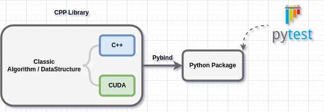

# Algorithm-Pyground
This repository implements various classic algorithms using `C++` and wraps them with `Pybind11` for `Python` integration. The algorithms are tested with `Pytest`. 

Algorithm-Pyground serves as a learning notebook for programming languages `(Python, C++, CUDA, etc.)`, algorithms, and related tools. Note that the features provided by each package are not exhaustive.

## Table of Contents
- [DataStructure](data_structure/README.MD)
- [Sorting](sortlib/README.MD)
- [Dynamic Programming](dp/README.MD)
- [Image Processing](image_processing/README.MD)